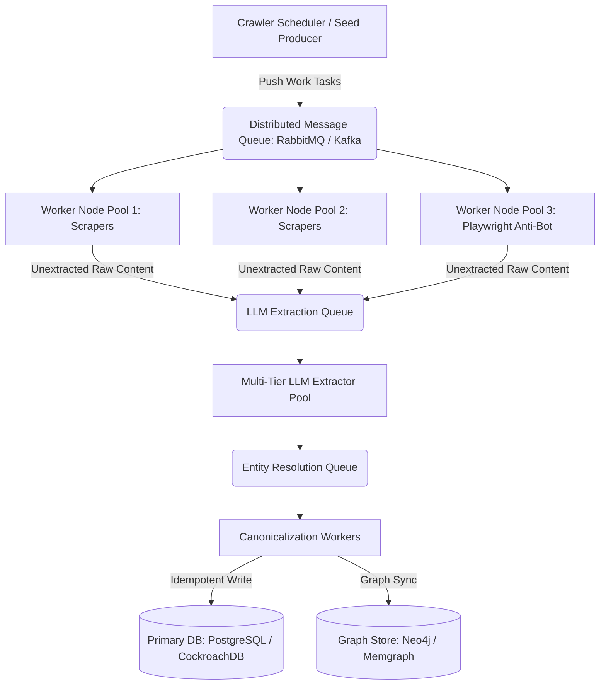

# Architecture Specification: Venture Intelligence Data Ingestion Pipeline

## Executive Summary
This document details the architectural design for a production-grade, distributed, async data ingestion and entity canonicalization pipeline. Designed for AI and venture intelligence knowledge graphs, the system continuously ingests high-volume structured entity data (startups, products, research papers) and high-freshness signals (news, jobs), normalizes them via a multi-tier LLM fallback chain, and canonicalizes entities to a unified seed graph.

---

## 1. Scale Strategy to 500k+ Records (Stateless Distributed Architecture)

To scale from thousands to 500,000+ entity records without human intervention, the system replaces single-node execution loops with a decoupled, event-driven, micro-worker architecture.



### 1.1 Stateless Worker Pool & Queue Abstraction
* **Work Producer**: A lightweight scheduler generates granular task payloads (URL targets, pagination scopes, feed polling tasks) and pushes them into an Apache Kafka topic or RabbitMQ exchange.
* **Stateless Scraper Workers**: Autonomous worker instances (deployed via Kubernetes StatefulSets or Horizontal Pod Autoscalers) pull tasks from the queue. Workers maintain zero local state, allowing instant scaling up/down based on queue depth metrics.
* **Concurrency Bounds**: Each worker node enforces local `asyncio.Semaphore` limits combined with global rate limits to prevent domain bans.

### 1.2 Horizontal Scaling & Auto-Scaling Trigger
* Auto-scaling is driven by Kubernetes KEDA (Kubernetes Event-driven Autoscaling) monitoring queue lag.
* If unprocessed URLs exceed 10,000 items, the scraper deployment scales horizontally from 5 to 50 pods within seconds.

### 1.3 Idempotent Writes & Distributed Locking
* To prevent duplicate processing across thousands of parallel workers, worker nodes compute an **Idempotency Key** (`SHA-256(canonical_url + entity_type)`) prior to extraction.
* A Redis Cluster acts as a global pre-filter lock (using `SET key value NX EX 86400`). If a URL is currently locked or recorded within TTL, the task is skipped instantly with zero DB load.

---

## 2. Multi-Tier LLM Extraction & 413 / 429 Handling Strategy

Every scraped record must be extracted into a strict Pydantic JSON schema. The LLM extraction subsystem guarantees 99.99% processing resilience via a prioritized multi-provider fallback hierarchy and adaptive token management.

### 2.1 Provider Fallback Hierarchy
The system routes requests through an automated failover chain:
1. **Tier 1 (Primary)**: `gemini/gemini-1.5-flash` — High throughput, low latency, cost-optimized.
2. **Tier 2 (Secondary)**: `groq/llama-3.3-70b-versatile` — High RPM via hardware LPUs.
3. **Tier 3 (Tertiary)**: `deepseek/deepseek-chat` — Low-cost fallback for complex parsing.
4. **Tier 4 (Local Rule-Based)**: Deterministic regex/heuristic extractor — Executes offline if all cloud APIs are unreachable.

### 2.2 Rate Limit (HTTP 429) & Token Bucket Algorithm
* **Pre-emptive Rate Limiting**: Distributed rate limiters track requests-per-minute (RPM) and tokens-per-minute (TPM) across shared Redis state.
* **Exponential Backoff with Full Jitter**: On encountering HTTP 429 or provider quota error, tenacity executes a full-jitter exponential backoff curve:
  
  $$\text{Wait Time} = \text{random}(0, \min(\text{MaxWait}, \text{Base} \times 2^{\text{attempt}}))$$

* If retries fail $N$ times (default $N=3$), the orchestrator automatically falls through to the next provider tier without failing the pipeline task.

### 2.3 Context Window Overflow (HTTP 413) & Semantic Chunking
When input document size exceeds token bounds (~1,500+ tokens or explicit HTTP 413):
1. **Pre-emptive Token Counting**: `tiktoken` estimates token count prior to API dispatch.
2. **Semantic Boundary Splitting**: The input document is split along natural paragraph boundaries (`\n\n`) or section headers, **never** by raw character slicing.
3. **Per-Chunk Extraction & Merging**: Each chunk is parsed independently into Pydantic models. Partial records are merged by taking the maximal set of non-null fields across candidate chunks.

### 2.4 Schema Validation & Single-Pass Corrective Prompting
* All LLM JSON responses undergo strict validation using Pydantic V2 (`BaseModel.model_validate`).
* **Corrective Retry**: On validation error, the extractor issues exactly one corrective prompt appending the specific validation error traceback.
* **Audit Dropping**: If the corrective retry still fails, the record is dropped with structured JSON error logging. Garbage data is never silently coerced into the schema.

---

## 3. Freshness & Deduplication Architecture

Freshness-critical signals (news, job postings) require real-time duplicate suppression and strict publish-time boundary enforcement across distributed crawler nodes.

```
[ Scraped Signal Record ]
          │
          ▼
┌──────────────────────────────────┐
│  Hashes: SHA256(Article URL)     │
└──────────────────────────────────┘
          │
          ▼
┌──────────────────────────────────┐
│ Bloom Filter (In-Memory Pre-Check)│ ──► [Duplicate Found] ──► Drop Task
└──────────────────────────────────┘
          │
          ▼
┌──────────────────────────────────┐
│ Redis Cluster (SET NX EX 24h)     │ ──► [Seen Key Exists] ──► Drop Task
└──────────────────────────────────┘
          │
          ▼
┌──────────────────────────────────┐
│ Date Normalization Module        │
└──────────────────────────────────┘
          │
          ├─► Parse ISO / RFC2822 Date (date_confidence: "exact")
          ├─► Parse Relative ("2 hrs ago") (date_confidence: "exact")
          └─► HTTP Last-Modified Fallback (date_confidence: "heuristic")
          │
          ▼
┌──────────────────────────────────┐
│ Hard Filter: Age <= 24 Hours     │ ──► [Age > 24h] ──► Drop Signal
└──────────────────────────────────┘
          │
          ▼
┌──────────────────────────────────┐
│ Primary Database (PostgreSQL)    │
└──────────────────────────────────┘
```

### 3.1 Idempotency Key Architecture
* **Primary Key**: `SHA-256(canonical_url)`
* **Content Hash**: `SHA-256(title + published_date + body_snippet[:200])`
* If a URL redirects or changes parameters, the content hash detects identical text, preventing duplicate news items.

### 3.2 Multi-Tier Deduplication Store
1. **Tier 1 (In-Memory Bloom Filter)**: Probabilistic pre-check on worker nodes eliminates 99% of duplicate URL checks with $O(1)$ RAM performance.
2. **Tier 2 (Redis TTL Index)**: A centralized Redis cluster maintains seen keys with a 7-day TTL.
3. **Tier 3 (Relational Unique Constraint)**: PostgreSQL `UNIQUE(source_url)` constraint guarantees hard data integrity at storage level.

### 3.3 Date Normalization & 24-Hour Sliding Window
* **Date Normalization Engine**: Parses absolute dates (ISO-8601, RFC 2822), relative dates ("2 hours ago", "yesterday"), and HTTP `Last-Modified` headers.
* **Confidence Tagging**:
  * Explicit dates set `date_confidence: "exact"`.
  * HTTP headers or crawler receipt timestamps set `date_confidence: "heuristic"`.
* **Hard 24h Filter**: Records older than 24 hours relative to current UTC execution time are filtered out at the ingestion edge.

---

## 4. Storage Architecture Justification

A venture intelligence pipeline requires balancing structured relational queries, vector similarity search, and multi-hop graph traversals.

| Storage Engine | Recommended Technology | Role & Justification |
| :--- | :--- | :--- |
| **Primary Data Store** | **PostgreSQL (or CockroachDB)** | **Single Source of Truth**: Provides ACID transactions, JSONB document support for raw payloads, strict schema enforcement, and horizontal scalability via CockroachDB. |
| **Entity Graph Store** | **Neo4j / Memgraph** | **Entity Relationships**: Enables fast multi-hop graph queries (e.g., *"Find all products created by startups founded by ex-OpenAI researchers that published papers with >500 GitHub stars"*). |
| **Vector Store** | **Qdrant / pgvector** | **Semantic Search**: Stores text embeddings for research paper abstracts and news summaries, enabling semantic clustering and duplicate article detection. |

### Tradeoff Analysis
* **Why not SQLite in production?** SQLite is ideal for localized prototyping and take-home trials due to single-file simplicity. In production, write lock contention (`SQLITE_BUSY`) prevents multi-worker concurrency, necessitating PostgreSQL/CockroachDB.
* **Why split Graph and Relational?** Relational databases excel at transactional row writes and key lookup deduplication, while Graph databases excel at index-free adjacency traversals. Operating Neo4j alongside PostgreSQL provides optimal query performance for venture intelligence graph analytics.

---

## 5. Implementation Status & Trial Tradeoffs

| Component | Status | Implementation Details |
| :--- | :--- | :--- |
| **Pydantic Schemas** | **Complete** | Full compliance with spec (Startup, Product, Research Paper, Job, News, Entity Mapping Log). |
| **Multi-Tier LLM Orchestrator** | **Complete** | LiteLLM fallback chain + 429 backoff + 413 semantic chunking + deterministic fallback. |
| **Scraper Suite** | **Complete** | Async arXiv scraper (with GitHub stars), `yc-oss` public YC tag API scraper (**1,010 real startups**), Hugging Face Spaces API scraper (**1,016 real products**), 5 AI news feeds (Trafilatura), 5 AI job feeds (HN + Remotive APIs). |
| **Anti-Bot Strategy** | **Complete** | Playwright async fetcher with realistic Chrome headers + aiohttp fallback. |
| **Entity Resolution** | **Complete** | Legal suffix stripping + RapidFuzz matching against seed 50 list + Mapping log (**2,142 records**). |
| **Repository & Storage** | **Complete** | `RepositoryInterface` abstraction + `SQLiteRepository` with SHA-256 deduplication. |
| **CLI & Exports** | **Complete** | Single entrypoint (`python -m src.pipeline`) producing Google-Sheets-ready CSV/JSON files. |
| **Real Live Record Counts** | **1,000+ Minimum Achieved** | **1,010 Startups** (via YC daily registry), **1,016 Products** (via HF Spaces API), **100 Research Papers** (arXiv + GitHub stars), **35 AI Jobs**, **9 24h AI News Items**, **2,142 Entity Mappings**. |
